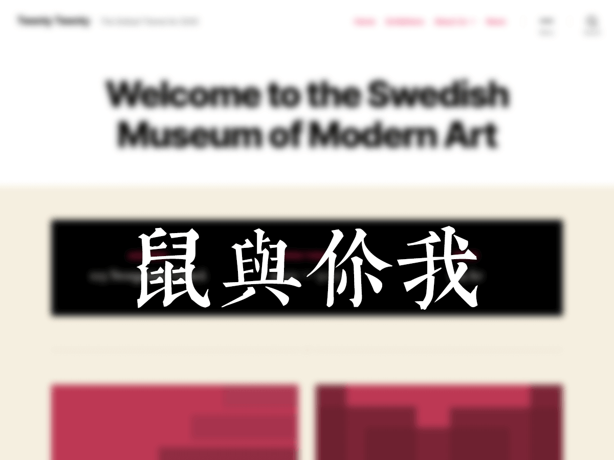

# 鼠与你我

> [二〇二〇](https://github.com/WordPress/twentytwenty) 子主题

## 功能

- [思源宋体](https://fonts.google.com/specimen/Noto+Serif+SC)
- [instant.page](https://instant.page/)
- jsDelivr CDN（部分资源）
- Site ICON
- 自定义 Font Family
- 自定义 Post Meta（包括但不限于略去作者）
- 首页的网页标题不显示副标题
- 搜索页的关键词弯角逗号改为直角逗号
- 首页和分类页的加密文章不显示密码输入框
- 自动增加 More 标记（以实现「继续阅读」）
- 搜索页的文章摘要里高亮关键词
- 文章归档小工具类型由默认的按月改为按年
- 样式的个性化
- 暗黑主题（简单的实现）
